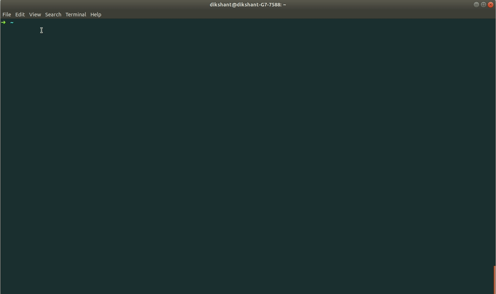

## Templates
Graphback provides users with choice of setting up custom environment with features with the help of templates. We plan to provides templates with multiple use cases including various server frameworks like GraphQL server frameworks like Apollo, Voyager and others.

Currently we provide `apollo-typescript-starter` only, and we'll be supporting more soon.

#### [apollo-typescript-starter](https://github.com/aerogear/graphback/tree/master/templates/apollo-starter-ts)
Basic typescript implementation of GraphQL server using apollo-express framework. Uses knex for database connection.

## Databases
Graphback allows you to configure your database according to your needs. We plan to provide support to multiple databases(MySQL, MongoDB etc). Currently we are supporting `PostgreSQL` only.

## Commands
### Init
  ```bash
  graphback init <project-name>
  ```
  The command will guide you through a series of questions - choosing a template, bootstraping model - and setup your project for you.

  

  You can also provide the template name as argument which will skip the template selection part.
  ```bash
  graphback init <project-name> [template-name]
  ```
### Generate
  ```bash
  graphback generate
  ```
  Generate command will generate schema and resolvers for your GraphQL server based on your datamodel.

### DB
  ```bash
  graphback db
  ```
  Create databases resources based on your datamodel. Currently supports PostgreSQL only
### Watch
  ```bash
  graphback watch
  ```
  Watches for changes in your datamodel and regenerates your schema and resolvers. The watch commands drops your database and recreates it with everty change to datamodel.