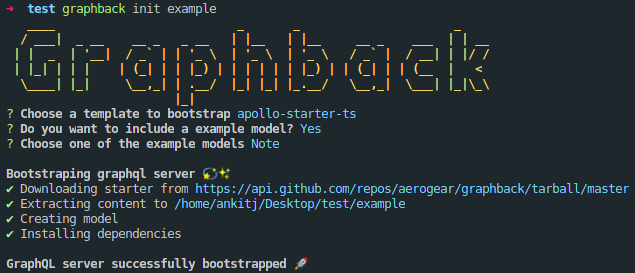

## Getting Started

```bash
npm i -g graphback-cli
```

## Commands
### Init
  ```bash
  graphback init <project-name>
  ```
  The command will guide you through a series of questions - choosing a template, bootstraping model - and setup your project for you.

  Example:

  

  You can also provide the template name as argument which will skip the template selection part.
  ```bash
  graphback init <project-name> [template-name]
  ```
### Generate
  ```bash
  graphback generate
  ```
  Generate command will generate schema and resolvers for your GraphQL server based on your datamodel.

### DB
  ```bash
  graphback db
  ```
  Create databases resources based on your datamodel. Currently supports PostgreSQL only
### Watch
  ```bash
  graphback watch
  ```
  Watches for changes in yout datamodel and regenerates your schema and resolvers along with modifying your database.