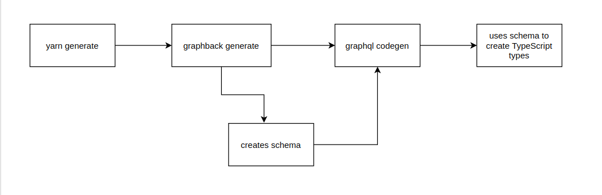

## Graphback PostgreSQL + Apollo Server Template

A template that provides you with an easy setup for your application's backend using PostgreSQL and Apollo server with TypeScript.

### Quickstart Guide

The project has been created using Graphback. Run the project using the following steps:

- Start the database

```
docker-compose up -d
```

- Inspect your schema in the `model/datamodel.graphql` file.
- Start the server

```
npm run develop
```

Or, if using yarn

```
yarn develop
```

For more on customizing your Graphback application, check out [our docs](https://graphback.dev/docs/gettingstarted)

If your project contains the client application then please follow [`./client/README.md`](./client/README.md) for info regarding running the client-side.

### Dependencies and Tools

The following tools and technologies have been used to create this template:

- [GraphQL](https://graphql.org/): GraphQL is an open-source data query and manipulation language for APIs which was publically released by Facebook in 2015.

- [Apollo Server](https://www.apollographql.com/docs/apollo-server/): Apollo Server provides a way to simplify building the GraphQL server. It can be used with several popular libraries for Node.js like Express, Koa, Hapi. Here we have used it with Express.

- [Express](https://expressjs.com/): Express is a minimal and flexible Node.js web application framework that makes building a Node.js server easier by providing a wide range of features.

- [GraphQL Code Generator](https://graphql-code-generator.com/): GraphQL Code Generator is a tool that generates code out of your GraphQL schema by analyzing it.

- [PostgreSQL](https://www.postgresql.org/): PostgreSQL, also known as Postgres, is a popular open-source relational SQL database.

### Project structure

The project contains the following set of source files.

- The `model` folder, which contains a GraphQL schema file defining your [business models](https://graphback.dev/docs/model/datamodel). This file can be edited to suit your needs.
- The `.graphlrc.yml` file defining the configuration like the path to business model declaration, how to perform code generation from the GraphQL types to Typescript types etc. The configuration file is defined using the GraphQL project using [`graphql-config`](https://graphql-config.com/introduction).
- A `docker-compose.yml` file to spin up the database if you do not have a running instance.
- A `.env` file that contains different environment variables.
- A `src` folder which has:
  - A `resolvers` folder where you can declare your custom resolvers to suit your use cases. This folder contains an example `src/resolvers/noteResolvers.ts` resolver file which can be deleted or modified. See [Custom Resolvers guide](https://graphback.dev/docs/resolvers/custom-resolvers) for more information.
  - A `schema` folder that contains generated schema file. It's advised to not edit this file manually. See [Generating types.](#re-generating-types-from-schema)
  - A `generated-types.ts` file, which is also generated as indicated by its name. See [Generating types.](#re-generating-types-from-schema)
  - A `index.ts` file that configures and starts a [Graphback application.](https://graphback.dev/docs/getting-started/add-to-project).
  - A `db.ts` file which indicates how to start a database connection.

> NOTE: All the files can be edited according to your needs except for those that are generated (no need to edit them as they'll be re-generated anyway).

### Updating the business model

If you made changes to your business model, it's advised to regenerate the `generated-types.ts` which contains TypeScript file of your business entities.

```
yarn generate
```

This will update the generated `schema.graphql` file and then generate the `generated-types.ts` file.

Running `yarn generate` executes a script which relies on two things, [Graphback CLI](https://graphback.dev/docs/cli/graphback-cli) and [Codegen](https://graphql-code-generator.com/). It is a two step process which is explained below.

> NOTE: You have to run the above commands on each modification of your business model on the server-side. This ensures that the client is kept in sync with changes on the server-side.

### Step 1: GraphQL Schema File Generation

A GraphQL schema describes the functionality available to the client applications that connect to it. The [Graphback CLI](https://graphback.dev/docs/cli/graphback-cli) is used to run the `graphback generate` command which executes the generation process to create a graphql schema. This schema is stored in the `schema.graphql` file.

### Step 2: Code Generation

The next step is to use this schema to create the TypeScript types. [Codegen](https://graphql-code-generator.com/) is used in the `graphql codegen` command which generates this code from the GraphQL schema in the `generated-types.tsx` file. This makes sure that whenever you make changes to your data model you don't have to manually change the file because running `yarn generate` does that for you.


