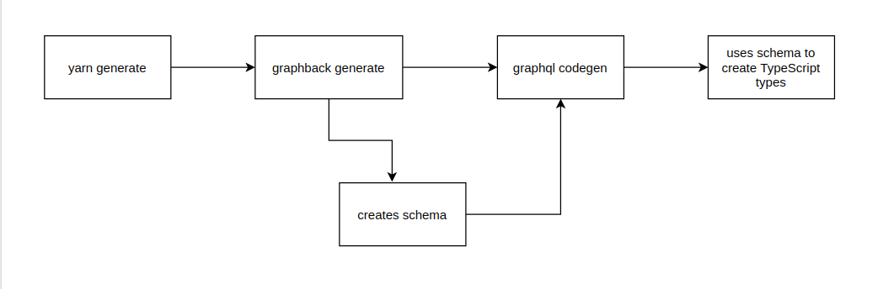

# Graphback React Sample application

A starter template for React while using one of the Graphback based backend templates.

## Quickstart Guide

This project has been created using Graphback.
Run the project using the following steps:

- Install

```bash
yarn install
```

- Start React App

In the `client` directory run:

```bash
yarn start
```

> NOTE: The client application has been made for a sample model. When you make changes on the server side, the client side application will NOT change itself automatically and will require manual changes to be made.

## Dependencies And Tools

The following tools and technologies have been used to create this template:

- [GraphQL](https://graphql.org/): GraphQL is an open-source data query and manipulation language for APIs which was publically released by Facebook in 2015.

- [Apollo Client](https://www.apollographql.com/docs/react/): Apollo Client provides a neat abstraction layer and an interface to interact with the GraphQL server. It allows easier building of UI components that fetch data via GraphQL.

- [React](https://reactjs.org/): React is an open-source JavaScript library for building user interfaces or UI components which is maintained by Facebook and a community of individual developers and companies.

- [Material UI](https://material-ui.com/): Material-UI is an open-source project that features React components that implement Google's Material Design. It has been used for styling this sample React template.

- [GraphQL Code Generator](https://graphql-code-generator.com/): GraphQL Code Generator is a tool that generates code out of your GraphQL schema by analyzing it.

## Project structure

The project contains the following set of source files.

- The `.graphlrc.yml` file defining the configuration like the path to business model declaration, how to perform code generation from the GraphQL types to Typescript types etc. The configuration file is defined using the GraphQL project using [`graphql-config`](https://graphql-config.com/introduction).
- A `public` folder which contains static files.
- A `src` folder which has:
  - A `components` folder defining react components for each type of business model.
  - A `graphql` folder which contains a generated `graphback.graphql` using the [generate command](#development-and-adjustment-to-schema-changes) and a custom `getDraftNotes.graphql`. You can add additional custom GraphQL files according to your needs.
  - A `generated-types.tsx` file, which is also generated as indicated by its name. See [Generating types](#development-and-adjustment-to-schema-changes)
  - The rest of the files are to initialize a standard ReactJs Progressive Web App.

> NOTE: All the files can be edited according to your needs except for those that are generated (no need to edit them as they'll be re-generated anyway).

## Development and adjustment to schema changes

The client is designed to work only with the sample schema.
When changing the Graphback schema you will need to recompile all the changes.

- Generate React components

```
yarn generate
```

Running `yarn generate` executes a script which relies on two things, [Graphback CLI](https://graphback.dev/docs/cli/graphback-cli) and [Codegen](https://graphql-code-generator.com/). It is a two step process which is explained below.

> NOTE: You have to run the above commands on each modification of your business model on the server-side. This ensures that the client is kept in sync with changes on the server-side.

### Step 1: GraphQL Document Generation

A GraphQL schema describes the functionality available to the client applications that connect to it. The [Graphback CLI](https://graphback.dev/docs/cli/graphback-cli) is used to run the `graphback generate` command which executes the generation process to create a graphql schema. This schema is stored in the `graphback.graphql` file.

### Step 2: Code Generation

The next step is to use this schema to create the TypeScript types. [Codegen](https://graphql-code-generator.com/) is used in the `graphql codegen` command which generates this code from the GraphQL schema in the `generated-types.tsx` file. This makes sure that whenever you make changes to your data model you don't have to manually change the file because running `yarn generate` does that for you.


