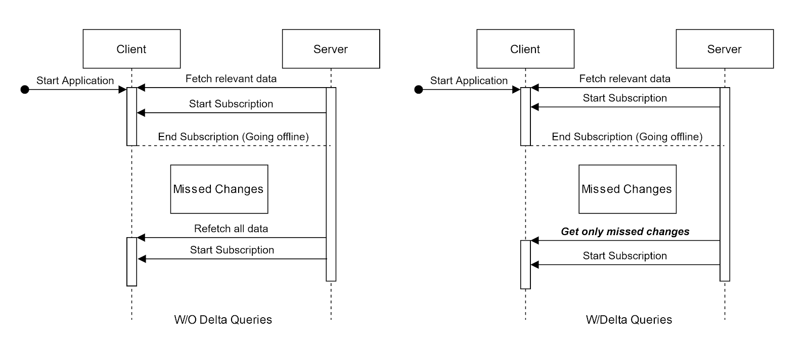
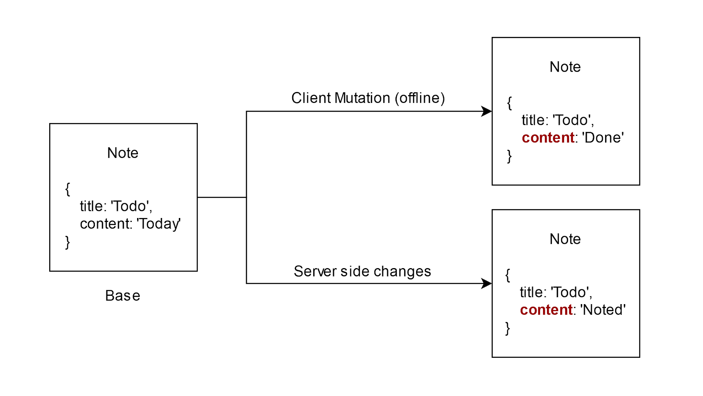
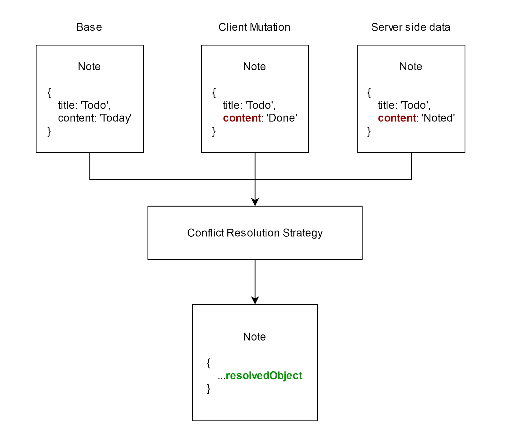

GraphQL subscriptions are a perfect fit for situations where users like to receive instant updates for some specific types of data. Subscriptions are very flexible and allow developers to connect directly to the stream of the changes generated on the server side.
Subscriptions deliver delta updates to the client only when clients are subscribed. To receive partial updates after an application is restarted developers can use the concept of delta queries.
## Delta queries
Delta queries are a concept that allow users to perform a query that will return partial data based on a specific separator that is usually represented as a sequence or timestamp or any date series that will separate a sorted dataset into data we have seen and a delta that should be returned to clients.



## Delete is challenging
Not every dataset can support delta queries. Every deletion of the data will remove it from the database which means that sorting and splitting the dataset to retrieve updates will destroy it.

## Conflict resolution
In an offline-first application, where a client may often switch between being online and offline, conflicts between client-side and server-side data are almost guaranteed to occur. It is of utmost importance these conflicts are detected and some mechanism is  in place to resolve these conflicts.



### Solution?
<!-- = Meme here - you telling me I can stop deleting my data? -->

- Stop deleting data in the table to introduce soft deletes 
- Have separate table for delete operations and merging results when sending data to clients
- Have separate table that can be used to query diffs 

These concepts are very common and are often needed when building applications that will consume large amount of data that needs to be available on the client - especially when the client is designed to work without network connectivity.

### GraphQL CRUD spec for delta queries

That is why we have built and included delta operations as well as conflict resolution into GraphQLCRUD.org specification.
Today we are glad to announce that DeltaQueries as well as Server-side Conflict Resolution are officially available as part of the Graphback.dev project that implements this specification.
Graphback is a library that lets you auto-generate your GraphQL Data layer at runtime. The latest release of Graphback provides support for delta queries as well as server-side conflict resolution.

## What is DataSync?

DataSync is short for data synchronization and that’s what we set out to do with this package. When a GraphQL client goes offline for sometime, e.g. because of a poor network connection, the data cached by the client can get outdated pretty fast and without a live subscription to fetch those changes it becomes imperative that a client provide some way to be up to date with the data as soon as it comes back online. That is DataSync.

DataSync is the reference implementation for the Delta Queries and Conflict Resolution extension of the GraphQLCRUD spec.

DataSync achieves this by providing a special type of query we like to call a delta query and extends the existing update resolvers to give out of the box server-side Conflict Resolution.
Delta Queries

A delta query is a GraphQL query that helps the client know what changed while they were offline. So as an example scenario if we were to fetch notes that were changed when we were offline, with DataSync this would go like:

```graphql title="Example delta query"
query {
  syncNotes(lastSync: 1590679886048, filter: { id: "e12jk12j4b214j1" }) {
      id
      text
      content
      _lastUpdatedAt
      _deleted
  }
}
```

```json title="Example response"
{
  "data": {
    "syncNotes": {
      "items": [
        {
          "id": "e12jk12j4b214j1",
          "text": "Weekly Agenda",
          "content": "All Done",
          "_lastUpdatedAt": 1591852693075,
          "_deleted": true
        }
      ],
      "lastSync": "1591852700920",
      "limit": null
    }
  }
}
```

Notice that we not only get the required fields like id and text, but also `_lastUpdatedAt` as well as if the post was `_deleted` , all of which are automatically maintained by DataSync.

## Server-side Conflict Resolution



Server-side Conflict resolution is the ability to resolve conflicts between the data that the client has, and the data present in the database. In offline-first applications, it is crucial to address availability problems to ensure the consistency of data between the server and the client. Graphback DataSync does this out of the box by maintaining a `_version` field and using it to track changes in data with delta tables that store intermediate versions of documents which can be used to implement their own conflict resolution strategies, on top of the DataSync provided strategies.

```graphql title="Final schema when using server-side conflict resolution"
type Comment {
  _id: GraphbackObjectID!
  text: String
  description: String
  _lastUpdatedAt: GraphbackTimestamp
  _version: Int
}

input MutateCommentInput {
  _id: GraphbackObjectID!
  text: String
  description: String
  _version: Int!
}
```

As it can be seen, when server-side conflict resolution is enabled, this changes the schema in two ways:

- Adding a `_version` field to the base GraphQL type
- Adding a `_version` field to the Mutation Input type

With this, a client can pass their version of the data and the server can detect inconsistencies between the client-side and server-side by using the `_version` field. The conflicts can then be resolved by a specified conflict resolution strategy. DataSync provides two conflict resolution strategies out of the box:
- ClientSideWins: The edits made by the client are never discarded and will always be persisted to the database
- ServerSideWins: The fields edited by the client never overwrite fields that have been updated on the server

In addition to this, custom conflict resolution strategies can also be built to suit specific use cases. All of this information and more can be found in the [DataSync docs](https://graphback.dev/docs/next/datasync/intro).

All of this can be easily setup with our DataSync enabled [graphql-serve](https://graphback.dev/docs/next/graphqlserve/graphqlserve).

### Setting Up a DataSync server

- Define your data model using GraphQL
```graphql
""" 
@model
@datasync
"""
type Comment {
  _id: GraphbackObjectID!
  text: String
  description: String
}

scalar GraphbackObjectID
```
This is going to be our data model. Notice that both types are annotated with @model and @datasync. The former is required for Graphback to recognise model types and the latter is required to enable DataSync for a specific model.

Visit the [docs](https://graphback.dev/docs/next/datasync/intro) for a complete reference to all Graphback supported annotations as well as a more involved introduction to DataSync.

Edit the data model as desired and move on.

- `npx graphql-serve serve model.graphql --datasync -p 4000` 

Navigate to [http://localhost:4000/graphql](http://localhost:4000/graphql) and test out queries.
Be sure to check out our docs for tons of other cool things that you can do with Graphback and DataSync!
